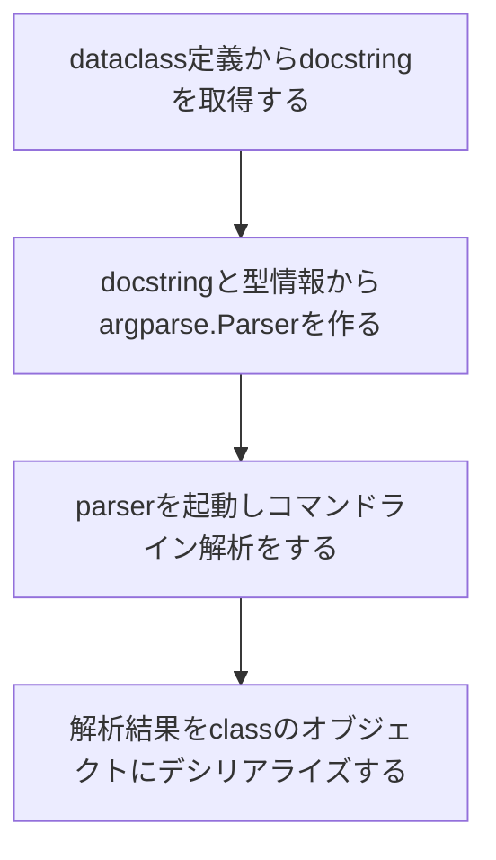

この記事は[Python Advent Calendar 2021](https://qiita.com/advent-calendar/2021/python) 17日目の記事です。

## Motivation

筆者は普段RustとPythonでコードを書くことが多いのですが、Rustには[structopt](https://github.com/TeXitoi/structopt) [^1]というとてもとても便利なライブラリがあり、コマンドラインパーサーを型を使って気持ちよく書けます。

### `structopt`

Rustの`structopt`では以下のようにstructにattributeを付けると、structがコマンドラインパーサーとなり、 型とattributeから様々な機能を持ったパーサーを作れます。

```rust
#[derive(StructOpt, Debug)]
#[structopt(name = "basic")]
struct Opt {
    #[structopt(short, long)]
    debug: bool,

    #[structopt(short, long, parse(from_os_str))]
    output: PathBuf,

    #[structopt(short = "c", long)]
    nb_cars: Option<i32>,

    #[structopt(name = "FILE", parse(from_os_str))]
    files: Vec<PathBuf>,
}
```

### `click`

筆者は以前から[click](https://github.com/pallets/click)というpythonのコマンドラインパーサーをよく使っていました。`click`を使うと以下のようにデコレータ使って宣言的にパーサーを作れて便利なのですが、解析結果が個別に変数になるのと、mypyやLSPで型を認識してもらうには、デコレータだけでなく変数側にも型宣言が必要だったりで面倒だと思っていました。

```python
@click.command()
@click.option("--count", default=1, help="Number of greetings.")
@click.option("--name", prompt="Your name", help="The person to greet.")
def hello(count, name):
    ...
```

また、オプションが多くなると自然とclassにまとめたくなりますが、以下のように別途dataclassを作るのも面倒でした。

```python
@dataclass
class Opt:
    count: int
    name: str

@click.command()
@click.option("--count", default=1, help="Number of greetings.")
@click.option("--name", prompt="Your name", help="The person to greet.")
def hello(**kwargs):
    opt = Opt(**kwargs)
    ...
```

## `oppapi`

以上の不満を解消するために[`oppapi`](https://github.com/yukinarit/oppapi) (おっぱっぴー)という新しいコマンドラインオプションパーサーを作り始めました。`oppapi`は[dataclasses](https://docs.python.org/3/library/dataclasses.html)と[argparse](https://docs.python.org/3/library/argparse.html)をベースにしており、
* `structopt`のように型を利用して気持ちよくCLIクライアントを書けること
* 複雑な設定をしなくてもデフォルトの挙動でやりたいことができる

を目指しています。名前はoptionっぽい和名でテキトーに決めました。


https://github.com/yukinarit/oppapi

## Usage

以下のようにclass定義に`@oppapi`デコレータを付けます。

```python
from typing import Optional
from oppapi import from_args, oppapi

@oppapi
class Opt:
    """
    Option parser using oppapi
    """

    host: str
    """ This will be a positional argument of type `str` """

    port: Optional[int] = 8000
    """ This will be an option argument of type `int` """

opt = from_args(Opt)
print(opt)
```

`from_args(Opt)`を実行すると、`Opt`クラスの型宣言に基づいてコマンドラインパーサーが生成されます。生成されたパーサーには以下の特徴があります。
* クラスのdocstringからパーサーのヘルプを生成する
* フィールドのdocstringから引数、オプション引数のヘルプを生成する
* フィールドは引数(Positional Argument)になる
* `Optional`なフィールドはオプション引数(Option Argument)になる

コマンドラインパーサーのヘルプを見てみます。
```
$ python simple.py -h
usage: simple.py [-h] [-p PORT] host

Option parser using oppapi

positional arguments:
  host                  Primitive type will be positional argument

optional arguments:
  -h, --help            show this help message and exit
  -p PORT, --port PORT  Optional type will be option argument
  ```

スクリプトに引数を与えてコマンド解析が成功すると、解析結果が`Opt`のオブジェクトデシリアライズされます。

```
$ python simple.py 127.0.0.1 -p 80
Opt(host='127.0.0.1', port=80)
```

## 使える型

* Primitives (`int`, `float`, `str`, `bool`)
* Containers (`List`, `Tuple`)
* `typing.Optional`
* [`enum`](https://github.com/yukinarit/oppapi/blob/main/examples/choice.py)
* [`datetime`](https://github.com/yukinarit/oppapi/blob/main/examples/mod_datetime.py)
* [`decimal`](https://github.com/yukinarit/oppapi/blob/main/examples/mod_decimal.py)
* [`ipaddress`](https://github.com/yukinarit/oppapi/blob/main/examples/mod_ipaddress.py)
* [`pathlib`](https://github.com/yukinarit/oppapi/blob/main/examples/mod_path.py)
* [`uuid`](https://github.com/yukinarit/oppapi/blob/main/examples/mod_uuid.py)

```python
@oppapi
class Opt:
    datetime: datetime
    date: Optional[date]
    time: Optional[time]

opt = from_args(Opt)
print(opt)
```

例えば`datetime`, `date`, `time`を使った`Opt`クラスでコマンドライン解析をすると、ちゃんと正しい型で返ってきてくれます。
```
$ python mod_datetime.py 2021-10-23T11:11:11 -d 2021-10-23 -t 11:11:11
Opt(datetime=datetime.datetime(2021, 10, 23, 11, 11, 11), date=datetime.date(2021, 10, 23), time=datetime.time(11, 11, 11))
```

## コマンドライン引数のshortとlongの設定

## `short`/`long`名の変更

デフォルトではフィールド名からコマンドラインフラグ名が生成されますが、`short`, `long`フィールドアトリビュートを付ければ、任意の`short`/`long`名に変更できます。

```python
from typing import Optional
from oppapi import from_args, oppapi, field

@oppapi
class Opt:
    host: Optional[str] = field(short="-n", long="--hostname")
```

## `enum`

`enum.Enum`、`enum.IntEnum`を設定すると、自動で[choices](https://docs.python.org/3/library/argparse.html#choices)パラメータを設定してくれます。

```python
class Food(Enum):
    A = "Apple"
    B = "Beer"
    C = "Chocolate"

class Price(IntEnum):
    A = 10
    B = 20
    C = 30

@oppapi
class Opt:
    food: Food
    price: Optional[Price]
```

usageはこのようになって、
```
positional arguments:
  {Apple,Beer,Chocolate}

optional arguments:
  -h, --help            show this help message and exit
  -p {10,20,30}, --price {10,20,30}
```

コマンド引数解析するとちゃんとEnum型に戻してくれます。

```python
$ python choice.py Apple --price 20
Opt(food=<Food.A: 'Apple'>, price=<Price.B: 20>)
```

## `List`/`Tuple`

`List`は任意長の引数(`nargs="+"`)になり、`Tuple`は固定長の引数(`nargs=NUM`)になります。
```python
@oppapi
class Opt:
    values: List[int]
    opts: Optional[Tuple[int, str, float, bool]]
```

```
$ python nargs.py 1 2 3 --opts 10 foo 10.0 True
Opt(values=[1, 2, 3], opts=(10, 'foo', 10.0, True))
```

## SubCommand

**※まだかなり限定的にしか動かないです**

`typing.Union`を使って他の`oppapi`クラスをネストするとsubcommandにすることができます。

```python
from typing import Optional, Union
from oppapi import from_args, oppapi

@oppapi
class Foo:
    a: int

@oppapi
class Bar:
    b: Optional[int]

@oppapi
class Opt:
    cmd: str
    sub: Union[Foo, Bar]
```

コマンドラインに`"foo"`を与えると`Foo`になってくれます。

```python
$ python subcommand.py hello foo 10
Opt(cmd='hello', sub=Foo(a=10)) True
```

今度はコマンドラインに`"bar"`を与えると`Bar`になってくれます。

```python
$ python subcommand.py hello bar -b 100
Opt(cmd='hello', sub=Bar(b=100)) False
```

## どうやって動いているか

ざっくりこんな流れになります。



### dataclass定義からdocstringを取得する

`structopt`の欠かせない機能は、structのコメントからコマンドラインのヘルプを生成することでした。`dataclasses`で提供されている機能ではコメントを取得するのは不可能なので、新たに[okome](https://github.com/yukinarit/okome)というdataclass定義からクラスとフィールドのdocstringを取得するライブラリを作りました。

https://github.com/yukinarit/okome

こんなクラスがあった場合
```python
@dataclasses.dataclass
class Foo:
    """
    This is a comment for class `Foo`.
    """
    a: int
    """ This is valid comment for field that can be parsed by okome """
```

クラスとdocstringのコメントを取得できます。
```python
c = okome.parse(Foo)
print(f"Class comment: {c.comment}")
for f in c.fields:
    print(f'Field "{f.name}" comment: {f.comment}')
```

```
$ python simple.py
Class comment: ['This is a comment for class `Foo`.']
Field "a" comment: ['This is valid comment for field that can be parsed by okome']
Field "b" comment: ['Multi line comment', 'also works!']
```

### 解析結果をclassのオブジェクトにデシリアライズする

`argparse.ArgumentParser`の解析結果は`vars`ビルトイン関数を使うと`dict`に変換できるので、dictからクラスへのデシリアライズを`pyserde`というライブラリを使って行っています。

[](https://github.com/yukinarit/pyserde)

## 今後について

`oppapi`はまだ生まれたばかりのToyプロダクトですが、頑張って開発は続けていきたいと思います。とりあえずは、以下を実装予定です。
* subcommandの安定化
* flatten
* コマンドのヘルプのcolorize
* その他`argparse`, `click`でできる機能の実装

今ならコントリビュートし放題なので、興味ある方は連絡ください。

[](https://github.com/yukinarit/oppapi)

[^1]: [2020 年版 Command Line Tool を作ってみる in Rust](https://qiita.com/watawuwu/items/a6cbcd92dfb5336b9a01)
