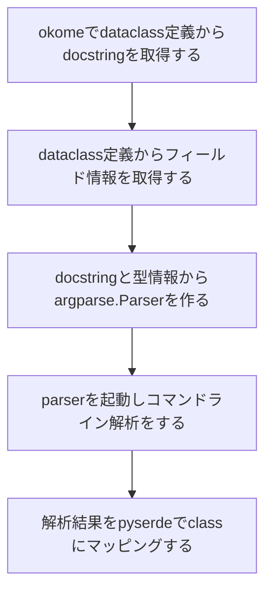

## Motivation

筆者は普段RustとPythonでコードを書くことが多いのですが、Rustには[structopt](https://github.com/TeXitoi/structopt) [^1]というとてもとても便利なライブラリがあり、コマンドラインパーサーを型を使って気持ちよく書けます。

### `structopt`

Rustの`structopt`クレートでは以下のようにstructにattributeを付けると、structがコマンドラインパーサーとなり、 型情報とattributeから様々な機能を持ったパーサーを作れます。

```rust
#[derive(StructOpt, Debug)]
#[structopt(name = "basic")]
struct Opt {
    #[structopt(short, long)]
    debug: bool,

    #[structopt(short, long, parse(from_os_str))]
    output: PathBuf,

    #[structopt(short = "c", long)]
    nb_cars: Option<i32>,

    #[structopt(name = "FILE", parse(from_os_str))]
    files: Vec<PathBuf>,
}
```

### `click`

筆者は以前から[click](https://github.com/pallets/click)というpythonのコマンドラインパーサーをよく使っていました。`click`を使うと以下のようにデコレータ使って宣言的にパーサーを作れて便利なのですが、解析結果が個別に変数になるのと、mypyやLSPで型を認識してもらうには、デコレータだけでなく変数側にも型宣言が必要だったりで面倒だと思っていました。

```python
@click.command()
@click.option("--count", default=1, help="Number of greetings.")
@click.option("--name", prompt="Your name", help="The person to greet.")
def hello(count, name):
    ...
```

また、オプションが多くなると自然とclassにまとめたくなりますが、以下のように別途dataclassを作るのも面倒でした。

```python
@dataclass
class Opt:
    count: int
    name: str

@click.command()
@click.option("--count", default=1, help="Number of greetings.")
@click.option("--name", prompt="Your name", help="The person to greet.")
def hello(**kwargs):
    opt = Opt(**kwargs)
    ...
```

### `oppapi`

以上の不満を解消するために`oppapi` (おっぱっぴー)という新しいコマンドラインオプションパーサーを作り始めました。`oppapi`は[dataclasses](https://docs.python.org/3/library/dataclasses.html)と[argparse](https://docs.python.org/3/library/argparse.html)をベースにしており、`structopt`のように型を利用して気持ちよくCLIクライアントを書けることを目指しています。

## Usage

```python
from typing import Optional
from oppapi import from_args, oppapi

@oppapi
class Opt:
    """
    Option parser using oppapi
    """

    host: str
    """ Primitive type will be positional argument """

    port: Optional[int] = 8000
    """ Optional type will be option argument """

opt = from_args(Opt)
print(opt)
```

このコードを実行すると、`Opt`クラスの型宣言に基づいてコマンドラインパーサーが生成されます。生成されたパーサーには以下の特徴があります。
* クラスのdocstringからパーサーの説明文を生成する
* フィールドのdocstringから引数、オプション引数の説明文を生成する
* フィールドは引数になる
* `Optional`なフィールドはオプション引数になる

```
$ python simple.py -h
usage: simple.py [-h] [-p PORT] host

Option parser using oppapi

positional arguments:
  host                  Primitive type will be positional argument

optional arguments:
  -h, --help            show this help message and exit
  -p PORT, --port PORT  Optional type will be option argument
  ```

スクリプトに引数を与えると、`Opt`クラスのインスタンスになります。

```
$ python simple.py 127.0.0.1 -p 80
Opt(host='127.0.0.1', port=80)
```

## Features


### コマンドライン引数のshortとlongの設定

### `short`/`long`名の変更

デフォルトではフィールド名からコマンドラインフラグ名が生成されますが、`short`, `long`フィールドアトリビュートを付ければ、任意の`short`/`long`名に変更できます。

```python
from typing import Optional
from oppapi import from_args, oppapi, field

@oppapi
class Opt:
    host: Optional[str] = field(short="-n", long="--hostname")
```

### `enum`

`enum.Enum`、`enum.IntEnum`を設定すると、自動で`choices`パラメータを設定してくれます。

```python
class Food(Enum):
    A = "Apple"
    B = "Beer"
    C = "Chocolate"

class Price(IntEnum):
    A = 10
    B = 20
    C = 30

@oppapi
class Opt:
    food: Food
    price: Optional[Price]
```

usageはこのようになって、
```
positional arguments:
  {Apple,Beer,Chocolate}

optional arguments:
  -h, --help            show this help message and exit
  -p {10,20,30}, --price {10,20,30}
```

コマンド引数解析するとちゃんとEnum型に戻してくれます。

```python
$ python choice.py Apple --price 20
Opt(food=<Food.A: 'Apple'>, price=<Price.B: 20>)
```

### `nargs`

`List`は任意長の引数(`nargs="+"`)になり、`Tuple`は固定長の引数(`nargs=NUM`)になります。
```python
@oppapi
class Opt:
    values: List[int]
    opts: Optional[Tuple[int, str, float, bool]]
```

### `datetime`
### `ipaddress`
### `pathlib`
### `decimal`
### `uuid`

## How does it work

ざっくりこんな流れになります。



各工程を説明していきます。

### `okome`でdataclass定義からdocstringを取得する

`structopt`の欠かせない機能として、structのコメントからコマンドラインのヘルプを生成することができます。dataclassesで提供されている機能ではコメントを取得するのは不可能なので、新たに
[okome](https://github.com/yukinarit/okome)というdataclass定義からクラスとフィールドのdocstringを取得するライブラリを作りました。

こんなクラスがあった場合
```python
@dataclasses.dataclass
class Foo:
    """
    This is a comment for class `Foo`.
    """

    a: int
    """ This is valid comment for field that can be parsed by okome """
    b: str
    """
    Multi line comment
    also works!
    """
```

クラスとdocstringのコメントを取得できます。
```python
c = okome.parse(Foo)
print(f"Class comment: {c.comment}")
for f in c.fields:
    print(f'Field "{f.name}" comment: {f.comment}')
```

```
$ python simple.py
Class comment: ['This is a comment for class `Foo`.']
Field "a" comment: ['This is valid comment for field that can be parsed by okome']
Field "b" comment: ['Multi line comment', 'also works!']
```

### dataclass定義からフィールド情報を取得する

`dataclasses`の[field](https://docs.python.org/3/library/dataclasses.html#dataclasses.field)関数を使えば、フィールドの変数名や型情報にアクセスできます。

### docstringと型情報からargparse.Parserを作る

### parserを起動しコマンドライン解析をする

### `pyserde`でclassにマッピングする

### 解析結果をpyserdeでclassにマッピングする


## 今後の

[^1]: [Rustエラーライブラリのトレンド解説（2020年1月版）](https://qiita.com/dalance/items/7e0fa481626c76d59f65)
